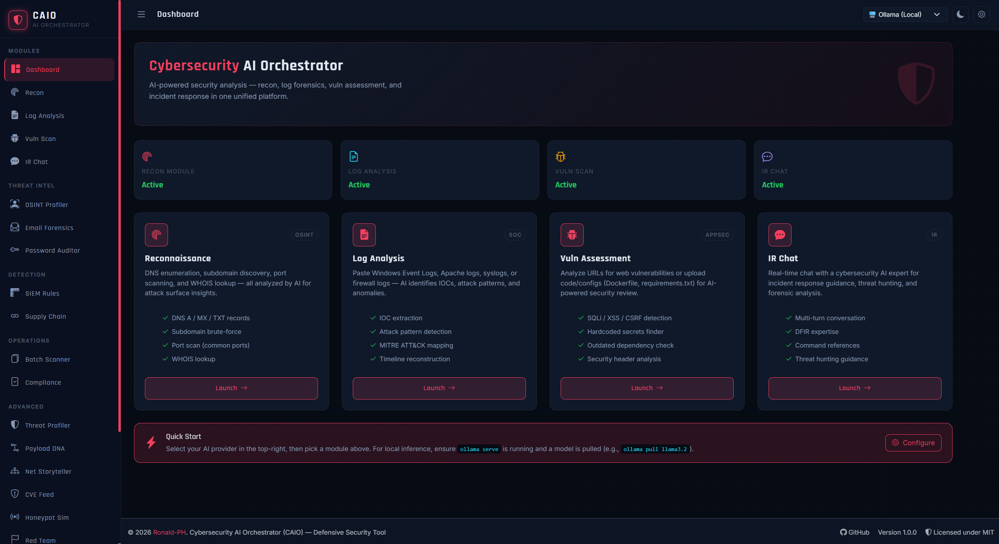

<div align="center">
  
  
  
  # CAIO — Cybersecurity AI Orchestrator
  
  [](https://github.com/Ronald-PH/caio)
  [](https://python.org)
  [](https://opensource.org/licenses/MIT)
  [](https://github.com/Ronald-PH/caio/stargazers)
  
  [](https://ollama.com)
  [](https://openai.com)
  [](https://anthropic.com)
  
  > **AI-Powered Security Platform | Reconnaissance | Log Analysis | Incident Response**
  
</div>

<br>

## 📌 Overview

CAIO has your back across the whole job. Run recon and vulnerability scans, drop in suspicious payloads for DNA analysis, paste in raw logs for AI-powered threat hunting, profile attackers with MITRE ATT&CK correlation, generate SIEM rules and red team playbooks, check vendors for supply chain risk, and walk through incident response step by step — all from one dashboard, all powered by AI. No more bouncing between ten different tools. CAIO's the partner that shows up for every stage of the fight, from first scan to final report.

**License:** MIT  
**Platform:** Windows 11 / Linux / macOS

---

## 🆕 What's New in 1.2.0

- **Autonomous repository security reviews** — Select a local workspace, describe the feature or security goal, and let CAIO inspect, patch (when explicitly enabled), validate, and produce an evidence-backed Markdown report.
- **Separate deployed-site assessment environment** — Black-box website scans use origin-scoped HTTP tools and a domain-specific local evidence workspace; they never confuse generated test artifacts with the deployed application's source repository.
- **Controlled Active Test Lab** — Authorized targets can opt into bounded POST form checks and inert text-file upload tests, with strict request caps, sensitive-field blocking, cleanup tracking, and no denial-of-service or off-origin behavior.
- **Adaptive agent execution** — CAIO sizes its initial tool budget from the task, can request justified extensions, detects repetitive actions, compacts long contexts, and reserves capacity for final report synthesis.
- **Safer workspace operations** — Exact workspace confinement, optional patching, PHP lint support, restricted command execution, file-level cleanup, and recovery guidance for malformed or ambiguous patches.
- **Live activity and cancellation** — Every agent action is visible, runs can be cancelled from the interface, and cancellation remains reliable across Flask reloads or worker boundaries.
- **Current advisory verification** — Framework, CMS, package, release, and CVE claims can be checked against current public primary sources before appearing as confirmed findings.
- **Broader Ollama compatibility** — CAIO normalizes strict chat templates, tool aliases, and message roles so more local models can participate in the autonomous workflow.

### Highlights from 1.1.0

- **MITRE ATT&CK Matrix** — A new visual grid that correlates your scan history against MITRE tactics and techniques, so you can see attacker coverage at a glance.
- **Incident Response Playbook Runner** — Step-by-step interactive checklists for common incident types (Ransomware, Phishing, SQL Injection) with progress tracking and exportable reports.
- **Scheduler is fully wired up** — Automated, cron-style recurring scans are now reachable from the sidebar, with proper support for comma lists, step values (`*/5`), ranges, and month fields.
- **Live Threat Map** — The dashboard now shows a real-time world map (powered by Leaflet) plotting your actual scanned targets by geolocation, with severity-coded pulses and a legend.
- **Repository (.zip) scanning** — Vulnerability Assessment now accepts whole `.zip` archives, not just single files, and audits the project for hardcoded secrets, config flaws, code vulnerabilities, and risky dependencies.
- **Print-based PDF export** — PDF export (scan history and compliance reports) now renders a polished, print-ready HTML page and triggers the browser's native print-to-PDF dialog, removing the `weasyprint`/`pdfkit` dependency requirement. The compliance report export also got a full visual redesign with a cover sheet and structured sections.

---

## ✨ Features

### Core Security Modules

| Module                       | Description                                                                                          |
| ---------------------------- | ---------------------------------------------------------------------------------------------------- |
| **Reconnaissance**           | DNS enumeration, subdomain discovery, port scanning, WHOIS lookup — all analyzed by AI               |
| **Log Analysis**             | Paste any log (Windows Event, Apache, Syslog, Firewall) → AI identifies IOCs, TTPs, attack patterns  |
| **Autonomous Vulnerability Review** | Prompt-driven local repository reviews and authorized deployed-site assessments with live agent activity, optional fixes, validation, evidence workspaces, and Markdown reporting |
| **IR Chat**                  | Multi-turn incident response assistant with DFIR expertise, MITRE ATT&CK mapping, command references |
| **VAPT Lab**                 | Real-world assessment workflow with free Docker tools: Nmap, ZAP, Nuclei, Nikto, testssl.sh, Trivy, Semgrep, and Gitleaks |

### Threat Intelligence

| Module                    | Description                                                                          |
| ------------------------- | ------------------------------------------------------------------------------------ |
| **OSINT Profiler**        | Build threat dossiers from GitHub, Certificate Transparency logs, and public sources |
| **Email Forensics**       | Parse email headers, detect spoofing, analyze SPF/DKIM/DMARC, identify phishing      |
| **Password Auditor**      | Analyze password entropy, detect patterns, check against breach dictionaries         |
| **CVE Intelligence Feed** | Live NVD lookup with AI contextualization and patch priority scoring                 |

### Detection & Response

| Module                    | Description                                                                            |
| ------------------------- | -------------------------------------------------------------------------------------- |
| **SIEM Rule Generator**   | Convert attack descriptions into Sigma, Splunk SPL, KQL (Sentinel), and Suricata rules |
| **Supply Chain Risk**     | Assess third-party vendors for CVEs, breach history, and trust indicators              |
| **Threat Actor Profiler** | Correlate IOCs/TTPs with known APT groups and MITRE ATT&CK techniques                  |
| **MITRE ATT&CK Matrix**   | Visual grid correlating scan history against MITRE tactics and techniques              |
| **Playbook Runner**       | Interactive incident response checklists (Ransomware, Phishing, SQLi) with export      |

### Advanced Analysis

| Module                   | Description                                                                         |
| ------------------------ | ----------------------------------------------------------------------------------- |
| **Payload DNA Analyzer** | Deobfuscate and analyze suspicious code (Base64, PowerShell, shellcode, VBA macros) |
| **Network Storyteller**  | Convert network logs into plain-English attack narratives with timelines            |
| **Honeypot Simulator**   | Generate realistic attack logs for training and SIEM testing                        |
| **Red Team Playbook**    | Generate structured adversary emulation plans based on target profiles              |

### Operations & Analytics

| Module                | Description                                                                      |
| --------------------- | -------------------------------------------------------------------------------- |
| **Batch Scanner**     | Run reconnaissance or vulnerability scans against multiple targets concurrently  |
| **Compliance Report** | Map findings to NIST 800-53, ISO 27001, or PCI DSS with gap analysis             |
| **Scheduler**         | Cron-style recurring scans with configurable frequency and email digests         |
| **Scan History**      | Every scan persisted to SQLite — searchable, filterable, exportable              |
| **Cost Dashboard**    | Track token usage and USD costs per provider/module with Chart.js visualizations |
| **Live Threat Map**   | Real-time world map plotting your scanned targets by geolocation                 |

---

## 🖥️ AI Provider Support

| Provider             | Type         | Cost Tracking            | Notes                 |
| -------------------- | ------------ | ------------------------ | --------------------- |
| **Ollama**           | Local (free) | Token count only         | Runs entirely offline |
| **OpenAI**           | Cloud (paid) | Input/output token costs | Requires API key      |
| **Anthropic Claude** | Cloud (paid) | Input/output token costs | Requires API key      |

---

## 🖼️ Screenshots

<div align="center">
  
  <br>
  <em>Main Dashboard</em>
</div>

---

## 🚀 Quick Start

### Prerequisites

- Python 3.10 or higher
- Git (optional)
- Ollama (for local AI — recommended)

### Windows 11 Installation

**1. Clone or download the repository**

```cmd
git clone https://github.com/Ronald-PH/caio.git
cd caio
```

**2. Create a virtual environment**

```cmd
python -m venv venv
venv\Scripts\activate
```

**3. Install dependencies**

```cmd
pip install -r requirements.txt
```

**4. Configure environment variables**

```cmd
copy .env.example .env
notepad .env
```

Edit the `.env` file:

- Set `SECRET_KEY` to a random string
- Add `OPENAI_API_KEY` and/or `ANTHROPIC_API_KEY` if using cloud providers
- For local inference, leave API keys blank

**5. Set up Ollama (recommended for local AI)**

1. Download from [ollama.com](https://ollama.com/) and install
2. Open a new terminal and run:
   ```cmd
   ollama serve
   ```
3. In another terminal, pull a model:
   ```cmd
   ollama pull llama3.2
   ```
   Other good options: `mistral`, `phi3`, `llama3.1:8b`, `codellama`

**6. Run CAIO**

```cmd
python app.py
```

Open your browser to: **http://127.0.0.1:5000**

---

## Autonomous Vulnerability Review

CAIO's vulnerability-review agent supports two deliberately separate execution environments.

### Local repository review

Choose a source workspace and a focused security goal, such as a full Laravel audit, authentication review, admin-panel review, dependency assessment, or audit of one specific feature. CAIO can:

- Detect frameworks and CMS products from repository evidence
- Inventory routes, controllers, services, models, policies, templates, dependencies, and configuration
- Trace attacker-controlled input to security-sensitive sinks
- Search current vendor and primary advisory sources before making version or CVE claims
- Provide safe reproduction examples and defensive regression tests
- Apply cohesive workspace fixes only when **Apply fixes to workspace** is enabled
- Resolve imports and dependencies introduced by a patch
- Run targeted validation and distinguish executed tests from inspection-only conclusions
- Continue a prior review while preserving its workspace and patch authorization

Repository tools are confined to the selected directory. Shell wrappers, destructive commands, path escapes, and unreliable inline PHP edits are blocked. PHP changes can be checked with the dedicated lint tool.

### Deployed website assessment

Choose an authorized HTTP(S) target and a local evidence workspace. CAIO creates a subfolder named after the target domain—for example, `security-workspaces/example.com`—and uses it only for plans, scripts, request samples, and evidence. It does **not** treat that folder as the remote site's source code.

The deployed-site environment can:

- Bootstrap an initial target inspection and bounded same-origin crawl
- Inventory discovered pages, forms, parameters, cookies, headers, and technology indicators
- Run predefined GET probes for reflection, output encoding, SQL-error behavior, boolean differences, open redirects, and traversal handling
- Create and update a local `README.md` assessment plan and `target.json` scope record
- Generate focused PHP or Python test scripts and execute safe exact-origin commands such as `curl`
- Persist evidence and produce a complete Markdown security report
- Cancel a running assessment from the interface

Localhost, private networks, Docker hostnames, LAN addresses, and custom ports are supported when explicitly authorized. Requests remain confined to the configured origin, redirects are not followed automatically, and reusable cookie values are redacted from activity output.

### Controlled Active Test Lab

For systems you own or have explicit permission to test, deployed-site mode can optionally enable controlled state-changing checks. This permits up to 20 rate-limited POST requests for marker-based form testing and harmless `.txt` multipart uploads.

The active environment continues to block payment, transfer, refund, messaging, account, role, permission, and deletion workflows; passwords and tokens; executable uploads; credential attacks; persistence; denial-of-service; and off-origin requests. Tests that may create marker data are labeled for cleanup.

### Agent reliability

Runs are persisted in SQLite and expose their tool activity in real time. CAIO includes adaptive step budgets, justified extensions, repetition detection, context compaction, final-synthesis protection, malformed tool-call recovery, patch enforcement for repository mode, artifact enforcement for website mode, and compatibility normalization for strict Ollama chat templates.

---

## Real-World VAPT Lab

CAIO includes an authorized-assessment workspace for practical VAPT demonstrations and client-style reporting. It uses free/open-source tools through Docker so you can run repeatable checks without installing every tool on the host.

Start CAIO:

```powershell
docker compose up -d caio
```

When CAIO runs in Docker on Windows and Ollama is installed locally on Windows, the compose file points CAIO to:

```text
http://host.docker.internal:11434
```

Make sure Ollama is running before starting CAIO:

```powershell
ollama serve
ollama pull qwen2.5:7b-instruct
```

Run free VAPT tools on demand:

```powershell
docker compose run --rm nmap -sV -sC -oA /work/output/nmap TARGET_HOST
docker compose run --rm zap -t https://TARGET_URL -r /zap/wrk/zap-baseline.html
docker compose run --rm nuclei -u https://TARGET_URL -severity low,medium,high,critical -o /work/output/nuclei.txt
docker compose run --rm nikto -h https://TARGET_URL -output /work/output/nikto.txt
docker compose run --rm testssl --htmlfile /work/output/testssl.html https://TARGET_URL
docker compose run --rm semgrep scan --config auto --json --output /work/output/semgrep.json /work/target
docker compose run --rm trivy fs --scanners vuln,secret,misconfig --output /work/output/trivy.txt /work/target
docker compose run --rm gitleaks detect --source /work/target --report-path /work/output/gitleaks.json --report-format json
```

Use `vapt/target/` for source code review input and `output/vapt/` for generated evidence. The in-app **VAPT Lab** page builds a target-specific runbook and keeps the workflow aligned to authorization, evidence collection, validation, remediation, and retesting.

The VAPT Lab can also ask your local Ollama model to create a real-world VAPT scenario: scope-safe discovery first, then TLS review, passive web baseline, web-server misconfiguration checks, known exposure checks, source review, dependency review, secret review, validation, and reporting. The model never receives shell access directly: CAIO accepts only known step IDs and executes fixed Docker command templates for the approved free tools. Before running tools, the page requires you to confirm written authorization for the target.

The **Autonomous VAPT Run** button performs the full flow in one action: Ollama plans the engagement, CAIO sanitizes the plan, and the backend executes only the approved Docker assessment tools. This is designed as an authorized security assessment orchestrator, not a general remote command execution or C2 framework.

For one-click execution from the browser, run CAIO on a host that has Docker Compose available, such as the normal local setup with `python app.py`. If CAIO itself is running inside a container, use the generated runbook commands from the host terminal unless you intentionally configure Docker socket access.

The provided Docker Compose setup mounts `/var/run/docker.sock` into the CAIO container so Autonomous VAPT Run can launch sibling tool containers and write evidence into `output/vapt`. This gives CAIO control of Docker on the host, so use it only on a trusted workstation or lab machine.

Only scan systems you own or have explicit written permission to test.

---

## 📁 Project Structure

<pre>
caio/
├── app.py                      # Flask application factory + routes
├── database.py                 # SQLite setup, queries, cost statistics
├── requirements.txt            # Python dependencies
├── .env.example                # Environment variable template
├── README.md                   # This file
│
├── modules/                    # Backend blueprints
│   ├── __init__.py
│   ├── ai_client.py            # Unified AI caller (Ollama/OpenAI/Claude)
│   ├── jobs.py                 # Background job manager (threading + SQLite)
│   ├── recon.py                # Reconnaissance module
│   ├── log_analysis.py         # Log analysis module
│   ├── vuln_scan.py            # Vulnerability assessment
│   ├── vapt_lab.py             # Docker-based real-world VAPT runbook
│   ├── chat.py                 # Incident response chat
│   ├── osint_profiler.py       # OSINT threat dossiers
│   ├── email_forensics.py      # Email header analysis
│   ├── password_auditor.py     # Password policy auditing
│   ├── cve_feed.py             # CVE intelligence
│   ├── siem_rule_generator.py  # Sigma/SPL/KQL/Suricata rules
│   ├── supply_chain_risk.py    # Third-party risk assessment
│   ├── threat_profiler.py      # Threat actor attribution
│   ├── payload_dna.py          # Malicious code analysis
│   ├── network_storyteller.py  # Network attack narration
│   ├── honeypot_simulator.py   # Fake attack log generation
│   ├── redteam_playbook.py     # Red team engagement plans
│   ├── batch_scanner.py        # Multi-target batch scanning
│   ├── compliance_report.py    # Framework gap analysis
│   ├── scheduler.py            # Cron-style automated scan scheduling
│   ├── mitre_correlation.py    # MITRE ATT&CK matrix correlation
│   ├── playbook_runner.py      # Interactive IR playbook checklists
│   ├── settings.py             # Configuration management
│   └── dashboard.py            # Landing page + live threat map API
│
├── templates/                  # Jinja2 HTML templates
│   ├── base.html               # Base layout with sidebar + theme toggle
│   ├── index.html              # Dashboard
│   ├── recon.html              # Reconnaissance page
│   ├── log_analysis.html       # Log analysis page
│   ├── vuln_scan.html          # Vulnerability assessment
│   ├── vapt_lab.html           # VAPT Lab workflow and Docker commands
│   ├── chat.html               # IR chat interface
│   ├── history.html            # Scan history with filtering
│   ├── cost_dashboard.html     # Cost analytics with Chart.js
│   ├── settings.html           # Configuration page
│   ├── batch_scanner.html      # Batch scanning interface
│   ├── compliance_report.html  # Compliance report generator
│   ├── cve_feed.html           # CVE lookup
│   ├── email_forensics.html    # Email analysis
│   ├── honeypot_simulator.html # Log simulator
│   ├── network_storyteller.html
│   ├── osint_profiler.html
│   ├── password_auditor.html
│   ├── payload_dna.html
│   ├── redteam_playbook.html
│   ├── siem_rule_generator.html
│   ├── supply_chain_risk.html
│   ├── threat_profiler.html
│   ├── mitre_grid.html         # MITRE ATT&CK matrix view
│   ├── playbook_runner.html    # IR playbook checklist UI
│   ├── scheduler.html          # Scan scheduling UI
│   └── pdf_export.html         # Print-ready report template
│
└── static/
    └── style.css               # Cyber-noir theme (dark/light modes)
</pre>

---

## 🔌 API Endpoints

| Endpoint               | Method | Description                                                  |
| ---------------------- | ------ | ------------------------------------------------------------ |
| `/health`              | GET    | JSON health status for all AI providers                      |
| `/progress/<job_id>`   | GET    | Poll background job status (used by recon)                   |
| `/history`             | GET    | Scan history with filtering (module, provider, target, days) |
| `/history/<id>`        | GET    | Full scan detail as JSON                                     |
| `/history/<id>/delete` | POST   | Delete a scan record                                         |
| `/cost-dashboard`      | GET    | Cost analytics page                                          |
| `/cost-dashboard/api`  | GET    | Cost analytics as JSON                                       |
| `/export/pdf/<id>`     | GET    | Open scan as a print-ready HTML page (Ctrl+P → Save as PDF)  |
| `/api/live-threats`    | GET    | Geolocated threat data for the dashboard live map            |
| `/vuln-scan/tasks`     | POST   | Start an autonomous repository or deployed-site review       |
| `/vuln-scan/tasks`     | GET    | List persisted autonomous runs with pagination               |
| `/vuln-scan/tasks/<id>` | GET   | Get run status, activity, configuration, and result           |
| `/vuln-scan/tasks/<id>/cancel` | POST | Cancel a running autonomous review                    |
| `/vuln-scan/tasks/<id>/export.md` | GET | Export the final review as Markdown                    |

### Module Routes (each with `/` and POST endpoints)

- `/recon/*` — Reconnaissance
- `/log-analysis/*` — Log analysis
- `/vuln-scan/*` — Vulnerability assessment
- `/chat/*` — IR chat
- `/osint-profiler/*` — OSINT threat dossiers
- `/email-forensics/*` — Email header forensics
- `/password-auditor/*` — Password auditing
- `/cve-feed/*` — CVE intelligence
- `/siem-rules/*` — SIEM rule generation
- `/supply-chain/*` — Supply chain risk
- `/threat-profiler/*` — Threat actor attribution
- `/payload-dna/*` — Malicious code analysis
- `/network-storyteller/*` — Network attack narration
- `/honeypot-simulator/*` — Honeypot log simulation
- `/redteam-playbook/*` — Red team playbooks
- `/batch/*` — Batch scanning
- `/compliance/*` — Compliance reporting
- `/scheduler/*` — Automated scan scheduling
- `/mitre/*` — MITRE ATT&CK matrix
- `/playbook-runner/*` — Incident response playbooks
- `/settings/*` — Configuration management

---

## 📊 Cost Dashboard

CAIO tracks token usage and costs for all API calls:

- **OpenAI:** Configurable rates (default: $0.005/1K input, $0.015/1K output)
- **Claude:** Configurable rates (default: $0.003/1K input, $0.015/1K output)
- **Ollama:** Free (token counting only)

The dashboard displays:

- Total cost over 30 days
- Cost breakdown by provider
- Cost breakdown by module
- Daily cost trend chart
- Recent cost details table

---

## 📄 PDF Export

CAIO renders a polished, print-ready HTML report (scan history and compliance reports) and triggers your browser's native print dialog — just choose **Save as PDF** as the destination. This removes the need for `weasyprint` or `wkhtmltopdf`/`pdfkit`, which previously required extra system dependencies (like the GTK3 runtime) that were awkward to install on Windows.

---

## 🛡️ Security & Legal Notice

CAIO is a **defensive security tool** intended for:

- Security professionals conducting authorized assessments
- SOC analysts investigating incidents
- System owners reviewing their own infrastructure
- Educational and research purposes

**⚠️ IMPORTANT:**

- Only scan, test, or analyze systems you own or have explicit written permission to test
- Keep controlled active testing disabled unless the target and workflow are explicitly authorized
- Prefer staging for state-changing checks because production integrations may trigger email, webhooks, alerts, or other side effects
- Unauthorized scanning is illegal in most jurisdictions
- The author assumes no liability for misuse of this tool
- Always follow responsible disclosure practices

---

## 💬 Support

- 🐛 [Report a Bug](https://github.com/Ronald-PH/caio/issues)
- 💡 [Feature Request](https://github.com/Ronald-PH/caio/issues)
- 📖 [Documentation](https://github.com/Ronald-PH/caio/wiki)
- 💬 [Discussions](https://github.com/Ronald-PH/caio/discussions)

---

---

## 🗺️ Roadmap

> Ordered by impact vs. effort within each category. This is a grounded, honest gap analysis of what CAIO is today vs. what it needs to be for team/production use.

### 🔐 Security & Access Control
*The biggest gap for anything beyond solo/local use*

| Priority | Item | Notes |
|---|---|---|
| 🔴 High | **User authentication & RBAC** | Anyone who can reach the Flask app has full control — analyst vs. admin roles needed |
| 🔴 High | **Encrypt API keys at rest** | Currently stored as plaintext in `.env` |
| 🔴 High | **Force SECRET_KEY setup** | Remove the hardcoded dev fallback so it can't ship insecure by accident |
| 🟡 Medium | **Audit logging** | Who ran what scan, when, from where — critical for team environments |

---

### 📡 Real Data Instead of Placeholders

| Priority | Item | Notes |
|---|---|---|
| 🔴 High | **Wire Supply Chain Risk to real feeds** | `supply_chain_risk.py` uses placeholder breach data — connect to HaveIBeenPwned API, OSV.dev, or GitHub Advisory Database |
| 🟡 Medium | **Live CVE polling** | CVE feed exists but is on-demand — add NVD/OSV webhook or background polling job for truly live updates |

---

### 👥 Collaboration & Team Features

| Priority | Item | Notes |
|---|---|---|
| 🟡 Medium | **Multi-user support** | Shared scan history, assigned cases, per-user dashboards |
| 🟡 Medium | **Webhook notifications** | Slack/Teams/Discord alerts for completed scans, critical findings, and scheduled results |
| 🟢 Low | **Shareable report links** | Currently reports are only local PDF/HTML — shareable URLs would help team handoffs |

---

### 📄 Reporting & Export

| Priority | Item | Notes |
|---|---|---|
| 🟡 Medium | **True binary PDF generation** | Browser print-to-PDF works but can't be emailed/archived programmatically — revisit a lightweight pure-Python PDF lib |
| 🟡 Medium | **JSON/CSV scan history export** | Useful for feeding findings into SIEMs or external tools |
| 🟢 Low | **Scheduled report digests** | Daily/weekly summary email, not just per-scan notifications |

---

### 🏗️ Architecture & Scale

| Priority | Item | Notes |
|---|---|---|
| 🟡 Medium | **Optional PostgreSQL backend** | SQLite is fine for solo use; needed for multi-user/multi-instance deployments |
| 🟡 Medium | **Proper job queue (Celery/RQ)** | Raw threading in `jobs.py` is fragile under load — replace with a real queue |
| 🟡 Medium | **Harden container deployment** | Dockerfile and Compose support exist; add rootless defaults, tighter capabilities, health checks, and production guidance |

---

### ✨ UX Polish

| Priority | Item | Notes |
|---|---|---|
| 🟢 Low | **Customizable dashboard widgets** | Let users choose which modules/stats appear on the home page |
| 🟢 Low | **Global search** | Search across scan history, IOCs, and reports from one place |
| 🟢 Low | **MITRE coverage diff view** | "Your ATT&CK coverage improved X% this month" over-time comparison |

---

## 🤝 Contributing

Contributions are welcome! Please:

1. Fork the repository
2. Create a feature branch
3. Submit a pull request

For bugs or feature requests, please open an issue on GitHub.


---

## 📧 Contact

For any inquiries or support, please reach out to
<br>
**GitHub:** [https://github.com/Ronald-PH](https://github.com/Ronald-PH)  
**Project:** [https://github.com/Ronald-PH/caio](https://github.com/Ronald-PH/caio)

---

## 🙏 Acknowledgments

- [Ollama](https://ollama.com/) — Local LLM inference
- [OpenAI](https://openai.com/) — GPT-4o API
- [Anthropic](https://anthropic.com/) — Claude API
- [Flask](https://flask.palletsprojects.com/) — Web framework
- [Bootstrap](https://getbootstrap.com/) — UI components
- [Chart.js](https://www.chartjs.org/) — Data visualization
- [Leaflet](https://leafletjs.com/) — Live threat map
- [Highlight.js](https://highlightjs.org/) — Code syntax highlighting

---

## 📜 License

MIT License — see [LICENSE](LICENSE) file for details.

---

<div align="center">
  
  **[Report Bug](https://github.com/Ronald-PH/caio/issues)** · **[Request Feature](https://github.com/Ronald-PH/caio/issues)** · **[Star on GitHub](https://github.com/Ronald-PH/caio)**
  
  *Built with ❤️ for the cybersecurity community*
  
</div>
